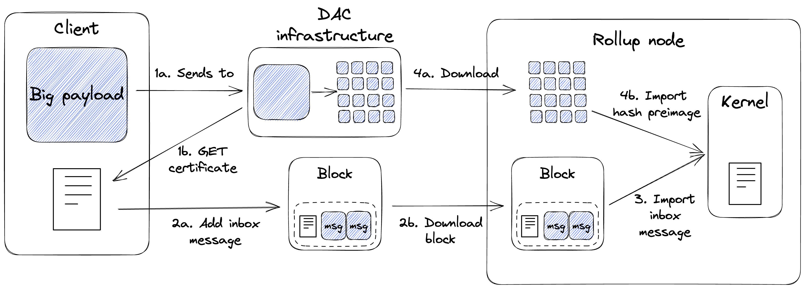

Data Availability Committee
===========================
Overview
^^^^^^^^
A Data Availability Commitee (DAC) is a solution for scaling the transaction 
throughput of Tezos smart rollups by incorporating a slight trust assumption. 
By using a DAC, smart rollups are able to bypass the data limit imposed by 
the Tezos block and increase the amount of transaction data available for 
processing beyond what is possibe from a Tezos block alone. 

DACs act a kind of data source to smart rollups such that the following properties are satisfied: 

- **Integrity**: Data imported into smart rollup are verifiably correct, that is, it is possible to prove that the data has not been tampered with.

- **Availability**: Any messages addressed to Smart rollups should be available upon request.

A DAC consists of a group of DAC Members that commit to storing copies of input data and making the 
data available upon request. Each DAC Member provide their signature of the root hash of the Merkle
Tree representation of the data as an attestation to that commitment. 

The DAC Members' signatures are aggregated into a DAC Certificate which clients can use 
to verify the number of signers, verify the integrity of data, and request underlying pages of
the root hash. However, the trust assumption here is that we assume DAC Members who have committed 
to make data available will follow through with their commitment.

DAC in Smart Rollups
--------------------

In the context of smart rollups, DAC is used to ensure the availability of data of the reveal 
data channel. The reveal data channel is a mechanism that enables the kernel to request data 
from a fixed location of the rollup node's local storage given that it satisfies the integrity 
property above. In short, scalability can be achieved because there is no limit on the amount 
of data that can be requested by the kernel. However, the reveal data channel lacks the assurance 
that the rollup node will have the page available in its local storage. By integrating with the 
DAC stack, the DAC will guarantee to make available the necessasry data to the rollup node. 

It is important to note that DAC is external to the Tezos protocol and that the Tezos Layer 1 is not aware 
of any DAC. 

Smart rollup nodes need to be configured to use the DAC stack to take advantage of its capabilities. 
Please see the ``_data_availability_committee_user_guide>`` and ``_data_availability_committee_operator_guide>`` 
for more inforation. 

Tools
-----
The DAC comes with two new executable: the ``octez-dac-node`` and the ``octez-dac-client``.

The ``octez-dac-node`` is used to set up a new committee or track an existing one. The 
``octez-dac-client`` is used to send payloads to the DAC for storage, and to retrieve 
certificates signed from the data availability committee.

There is also support for DAC in the Rust Kernel SDK to ease revealing the pages from the root hash
of the Dacified data and verifying Committee Member signatures.

The DAC Certificate
^^^^^^^^^^^^^^^^^^^
The DAC Certificate is a key artifact in the DAC workflow. It represents the commitment by the DAC 
Members to make data available upon request. It can be used to verify the data that was provided and 
the DAC Members who had signed it. It is composed for 4 attributes:
   
   * Version prefix - Version of the DAC Certificate schema.
   * Root hash - Merkle tree root hash of the payload.
   * Aggregate signature - Aggregate signature of the signatures of each DAC Member who had signed the root hash as attestation to commit to providing the data.
   * Witnesses - Bitset to indicate which DAC Member signature is included in the aggregate signature.

Workflow overview
^^^^^^^^^^^^^^^^^

#. The user sends a payload to a DAC (1a) and waits for a certificate with a sufficient number 
   of signatures (1b), as determined by the rollup kernel (the application logic of a particular rollup). 
#. The certificate, which is small in size (approximately 140 bytes), is posted to the rollup inbox as a Layer 1 
   message (2a) and will eventually be downloaded by the rollup node (2b). 
#. The rollup kernel imports the certificate contained in the rollup inbox, and verifies that it contains valid 
   signatures of several committee members. It is the responsibility of the rollup kernel to define the minimum number 
   of signatures required by a certificate to be considered valid
#. If the certificate is deemed valid, the rollup kernel will request to import the pages of the original payload 
   to the rollup node. The rollup node downloads those pages from the DAC infrastructure (4a) before importing them 
   into the kernel (4b).

The rollup kernel must implement the logic to determine if a DAC certificate is valid, and to request the original 
payload by importing the corresponding pages through the reveal data channel.

DAC stack
^^^^^^^^^
.. image:: ../images/dac_infra.png
   :width: 1000
   :height: 550
   :alt: DAC Stack

The DAC stack consists of a inter-connected the DAC nodes running in one of the Coordinator mode, 
Committee Member mode or Observer mode To setup a DAC, the network needs one Coordinator node 
and at least one Committee Member node.

It is desirable to have many more Committee Member nodes for added decentralization and redundancy. 
Ultimately, it is up to the DAC operators to decide what the suitable size of their DAC should be 
according to their use case.

The Coordinator acts as a gateway between the clients of the DAC and the other DAC nodes. It is 
responsible for receiving payloads, splitting them into pages of 4KBs each — the maximum size 
of a preimage that can be imported into a rollup — and forwarding the resulting pages to other 
nodes. The pages are split in such a way that they construct a Merkle Tree, ultimately resulting 
in a root hash (the Blake2b hash for root page content). Besides that, it is also responsible for 
providing DAC clients with DAC Certificates.

A Committee Member receives pages from the Coordinator and stores them on disk. Once all the pages 
for the original payload are received, the Committee Member sends a BLS12-381 signature to the 
Coordinator to attest its commitment to storing the data and making it available to external 
entities upon request. The Coordinator collects these signatures and includes them in the data 
availability Certificate for the respective payload.

To integrate with the DAC, an Observer must be run on the same host machine as the rollup node. The 
Observer receives pages from the Coordinator and stores them in the reveal data directory of the
smart rollup node. It also exposes an API endpoint that the rollup node can call if any pages are 
missing.

.. _data_availability_committee_user_guide:

User Guide
^^^^^^^^^^

In this section, we will look at how to use a DAC in a smart rollup setup. If you are interested in 
operating a DAC, the Operator Guide offers instructions on how to setup a DAC.

Pre-requisites
--------------
WIP

Verify DAC Certificate in the kernel
------------------------------------
WIP

Reveal DAC messages in the kernel
----------------------------------
WIP

Configure DAC Members in the kernel 
-----------------------------------
WIP 

Sending a message to a kernel via DAC
-------------------------------------
To send a message to the kernel via DAC, the kernel and the rollup node that the kernel is deployed to must already have 
DAC support. If you are kernel developer or rollup node operator and are looking to integrate with an existing DAC, the 
"Integrate DAC into a kernel" and "Integrate DAC into a rollup node" sections provide instructions on how to do that.
In this section, we will use the tx-kernel and tx-client as an example to show the general principles of sending payloads 
via DAC. 

Once our target kernel supports DAC, we are ready to DACify our payload and send it to the kernel. The process can be 
summarized in three steps.

   1. Generate a DAC Certificate.
   2. Prepare an External Message.
   3. Post External Message as an L1 operation.

WIP 

.. _data_availability_committee_operator_guide:

Operator Guide
^^^^^^^^^^^^^^^

In this section, we will look at how to setup a DAC. If you are a user of DAC, the User Guide 
offers instructions on how to use of a DAC in a smart rollup setup.

Deploying a Data Availability Committee
----------------------------------------
A Data Availability Committee consists of one Coordinator node and many Committee Members nodes. Once it the roles 
are decided and agreed on, the Coordinator must be deployed first, followed by the Committee Members.

#. Running a Coordinator

A Coordinator node can be configure with the following command 

.. code:: bash

   ./octez-dac-node configure as coordinator \
      with data availability committee members $TZ4_PUBLIC_KEYS \
      --data-dir $DATA_DIR \
      --reveal-data-dir $REVEAL_DATA_DIR
      

where

   * ``$BLS_PUBLIC_KEYS`` is a space separated list of BLS12-381 public keys of the committee members. Note that the order of keys will ultimately affect the Certificate's hash and should be respected among all parties in the DAC network.
   * ``$DATA_DIR`` is the directory containing the persisted store of the DAC node instance. Defaults to ``~/.octez-dac-node``. It is advised to provide an explicit value in case multiple DAC nodes run on the same host.
   * ``$REVEAL_DATA_DIR`` is a separate directory where pages are stored. Defaults to ``~/.tezos-smart-rollup-node/wasm_2_0_0``.

Once it configured, the Coordinator can be run with 

.. code:: bash

   ./octez-dac-node --endpoint $NODE_ENDPOINT \
      run --data-dir $DATA_DIR 

where

   * ``$NODE_ENDPOINT`` is the endpoint of the Tezos node to connect to. All inter-connected DAC nodes should be connected to Tezos nodes running on the same Protocol.

#.  Running a Committee Member

A Committee Member node can be configured with the following command

.. code:: bash

   ./octez-dac-node configure as committee member \
      with coordinator $COORDINATOR_RPC_ADDR \
      and signer $TZ4_ADDRESS \
      --data-dir $DATA_DIR \
      --reveal-data-dir $REVEAL_DATA_DIR

where:

   * ``$COORDINATOR_RPC_ADDR`` is the RPC address of the coordinator node, in the format {host}:{port}.
   * ``$TZ4_ADDRESS`` is the tz4 address of the account of the committee member.
   * ``$DATA_DIR`` is the directory containing the persisted store of the DAC node instance. Defaults to ``~/.octez-dac-node`` when missing. It is suggested to give it an explicit value in case multiple dac nodes run on the same host.
   * ``$REVEAL_DATA_DIR`` is a separate directory where pages are stored. Defaults to ``~/.tezos-smart-rollup-node/wasm_2_0_0``

Once configured, the Committee Member can be run with 

.. code:: bash

   ./octez-dac-node --endpoint $NODE_ENDPOINT \
      run --data-dir $DATA_DIR  

where

   * ``$NODE_ENDPOINT`` is the endpoint of the Tezos node to connect to. All inter-connected DAC nodes should be connected to Tezos nodes running on the same Protocol.

Integrate DAC into a Smart Rollup node
---------------------------------------
Before a rollup node can receive messages, a DAC Obsever node must run in the same host machine
as the the smart rollup executable and have its reveal data directory set to the same one as the 
rollup node. The rollup node would then need to be configured to request missing pages from the 
Observer node.

#. Run Observer node

An Observer node can be configured with the following command

.. code:: bash
   
   ./octez-dac-node configure as observer \
      with coordinator $COORDINATOR_RPC_ADDR \
      and committee member rpc addresses $COMMITTEE_MEMBER_RPC_ADDRESSES \
      --data-dir $DATA_DIR \
      --reveal-data-dir $REVEAL_DATA_DIR
      --rpc-addr $RPC_ADDR
      --rpc-port $RPC_PORT

where
   
   * ``$COORDINATOR_RPC_ADDR`` is the RPC address of the coordinator node, in the format {host}:{port}.
   * ``$COMMITTEE_MEMBER_RPC_ADDRESSES`` is a space separated list of the RPC addresses of the committee member nodes, in the format {host}:{port}.
   * ``$DATA_DIR`` is the directory containing the persisted store of the DAC node instance. Defaults to ``~/.octez-dac-node`` when missing. It is suggested to give it an explicit value in case multiple dac nodes run on the same host.
   * ``$REVEAL_DATA_DIR`` is the reveal data directory of the smart rollup node.
   * ``$RPC_ADDR`` is the address the DAC node listens to. Defaults to ``127.0.0.1``.
   * ``$RPC_PORT`` is the port the DAC node listens to. Defaults to ``10832``.

Once configured, the Committee Member can be run with 

.. code:: bash

   ./octez-dac-node --endpoint $NODE_ENDPOINT \
      run --data-dir $DATA_DIR  

where

   * ``$NODE_ENDPOINT`` is the endpoint of the Tezos node to connect to. All inter-connected DAC nodes should be connected to Tezos nodes running on the same Protocol.

#. Enable fetching missing pages from Observer

The rollup node must be configured with an Observer node to fetch missing pages. Note that even without 
the setup in this subsection, the Observer node will already push new pages into the reveal data directory
of the rollup node.

.. code:: bash
   
   ./octez-smart-rollup-node-alpha run \
      <..other configurations> \
      --dac-observer $OBSERVER_ENDPOINT \
      --dac-timeout $TIMEOUT

where 

   * ``$OBSERVER_ENDPOINT`` is the address of the Observer node from which the smart rollup node fetches missing pages, in the format {host}:{port}.
   * ``$TIMEOUT`` the timeout in seconds for which the rollup node will wait for a preimage from the Observer node. Defaults to 30 seconds.
